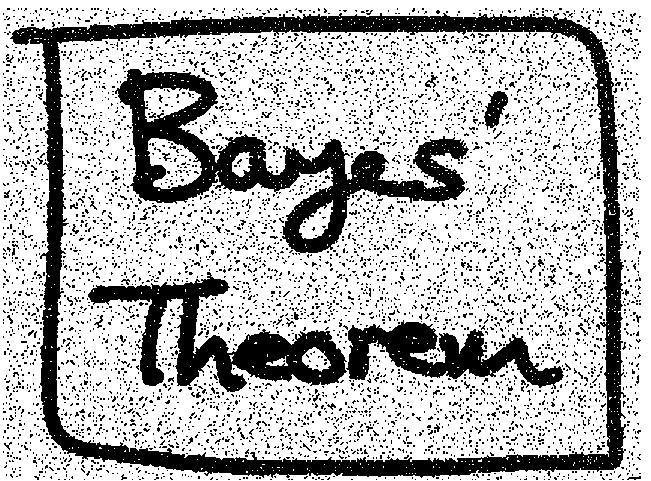
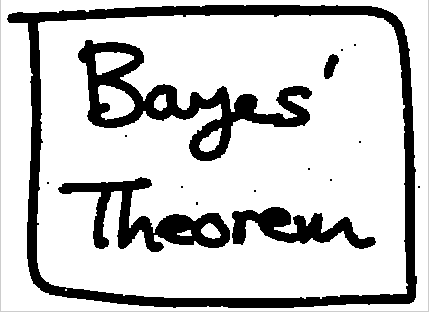
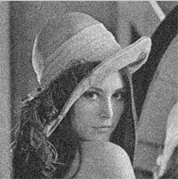

# Markov Random Field Depixelator

### Part A

For cs542, Machine Learning I implemented a image depixelator to clean up images. You can see the result below:

| Original | Processed |
| -------- | --------- |
|  | 

To run just run `hw5sol.m` in matlab.

I was able to get an accuracy of `99.45%` using the following params.

| h   | b   | n   |
| --- | --- | --- |
| -.01|  5  |  3  |

### Part B

I was able to implement a similar algorithm for part b on grayscale images. Instead of flipping a pixel, I either incremented it or decremented it, or left it the same. You can see the results below:

| Original | Processed |
| -------- | --------- |
|  | 

There's no definition of accuracy here, I'll let you decide which image looks better.

To run, run `hw5B.m` in the matlab interpreter.
